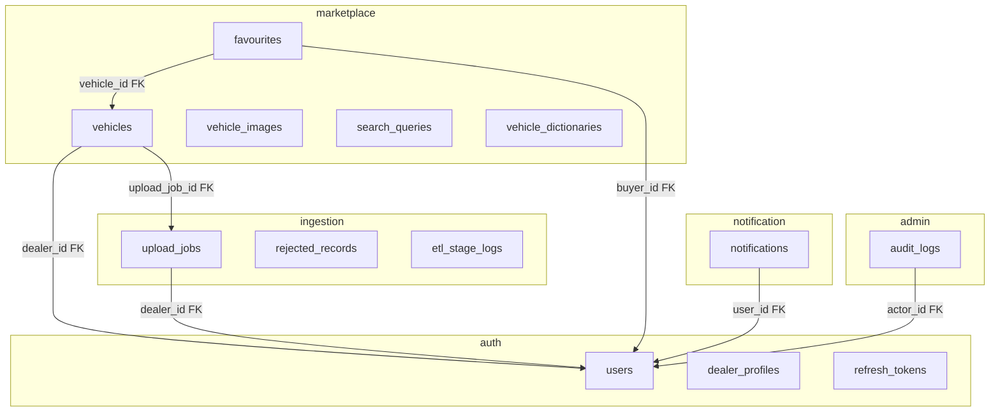

# Database & Entities Audit (Group 25)

**Purpose:** Single reference for fixing schema/entity problems before wiring services to PostgreSQL.  
**Last reviewed:** 10 August 2026  
**Source of truth for DDL:** [`database/src/migrations/`](../database/src/migrations/) + [`database/src/grants.sql`](../database/src/grants.sql)  
**Isolation model:** [plan-b-reads-cross-schemas.md](./plan-b-reads-cross-schemas.md)

---

## 1. Architecture at a glance

One **PostgreSQL 17** instance (`pgvector`, `pg_trgm`), **five schemas**, **five DB roles**.  
Migrations run **once** from the `database/` package — services never use `synchronize: true`.



**Write rule (Plan B):** Each service writes only its own schema, **except** ingestion ETL Load → `marketplace.vehicles` / `vehicle_images` (documented in `grants.sql`).

**Read rule:** Cross-schema `SELECT` only where an **FK already exists** (or admin read-only dashboard).

---

## 2. How to run the database locally

```powershell
# Repo root — Postgres only (docker-compose.yml; gateway is docker-compose.dev.yml)
Copy-Item .env.example .env
docker compose up -d
cd database
npm ci
npm run db:setup    # migrate + grants
```

| Variable | Role | Used by |
|---|---|---|
| `DATABASE_URL` | `marketplace` (superuser for migrations) | `database/` package only |
| `AUTH_DATABASE_URL` | `auth_service_role` | auth-user-service |
| `MARKETPLACE_DATABASE_URL` | `marketplace_service_role` | marketplace-service |
| `INGESTION_DATABASE_URL` | `ingestion_service_role` | ingestion-service |
| `NOTIFICATION_DATABASE_URL` | `notification_service_role` | notification-service |
| `ADMIN_DATABASE_URL` | `admin_service_role` | admin-service |

---

## 3. Migration order (18 files)

| # | Migration | Creates / changes |
|---|---|---|
| 1 | `1735000001000-SchemasAndExtensions` | Extensions + 5 schemas |
| 2 | `1735000002000-AuthUsers` | `auth.users` |
| 3 | `1735000003000-AuthDealerProfiles` | `auth.dealer_profiles` (initial) |
| 4 | `1735000004000-AuthRefreshTokens` | `auth.refresh_tokens` |
| 5 | `1735000005000-IngestionUploadJobs` | `ingestion.upload_jobs` |
| 6 | `1735000006000-MarketplaceVehicles` | `marketplace.vehicles` |
| 7 | `1735000007000-MarketplaceVehicleImages` | `marketplace.vehicle_images` |
| 8 | `1735000007500-MarketplaceReferenceData` | `makes`, `models`, `aliases` (later dropped) |
| 9 | `1735000008000-IngestionRejectedRecords` | `ingestion.rejected_records` |
| 10 | `1735000009000-IngestionEtlStageLogs` | `ingestion.etl_stage_logs` |
| 11 | `1735000010000-MarketplaceFavourites` | `marketplace.favourites` |
| 12 | `1735000011000-MarketplaceSearchQueries` | `marketplace.search_queries` |
| 13 | `1735000012000-NotificationNotifications` | `notification.notifications` |
| 14 | `1735000013000-AdminAuditLogs` | `admin.audit_logs` |
| 15 | `1735000014000-SearchIndexes` | HNSW/GIN indexes, `search_vector` trigger |
| 16 | `1735000015000-AuthDealerProfileDetails` | Tiered dealer columns + enums |
| 17 | `1735000016000-VehicleDictionaries` | Replaces makes/models/aliases → `vehicle_dictionaries` |
| 18 | `1735000017000-DropVehicleRawFields` | Drops `make_raw`, `model_raw` from vehicles |

**Note:** Migration 7500 creates tables that migration 1600 **drops**. Fresh `db:setup` runs both — end state is `vehicle_dictionaries` only.

---

## 4. Table catalogue (current schema)

### 4.1 `auth` schema

#### `auth.users`
| Column | Type | Notes |
|---|---|---|
| id | uuid PK | |
| email | varchar(255) UNIQUE | |
| password_hash | varchar(255) | |
| name | varchar(255) | |
| role | varchar(20) | `BUYER`, `DEALER`, `ADMIN` |
| is_active | boolean | default true |
| created_at, updated_at | timestamptz | |

**Entity:** `auth-user-service/.../user.entity.ts` — **aligned**

#### `auth.dealer_profiles`
| Column | Type | Notes |
|---|---|---|
| user_id | uuid PK, FK → users | |
| company_name | varchar(255) NOT NULL | |
| contact_number | varchar(50) **nullable** | |
| dealer_type | enum | `individual`, `business` (migration 1500) |
| business_registration_number | varchar(500) | |
| business_address | varchar(500) | |
| city | varchar(100) | |
| verification_documents | jsonb | S3 doc refs |
| verification_status | enum | `PENDING`, `VERIFIED`, `REJECTED` |
| created_at, updated_at | timestamptz | |

**Entity:** `dealer-profile.entity.ts` — **partial mismatch** (see §6)

**Missing for SRS FR-02.2:** `verified_by` (admin user id), `verified_at` (timestamptz)

#### `auth.refresh_tokens`
**Entity:** `refresh-token.entity.ts` — verify against migration `1735000004000` when wiring auth.

---

### 4.2 `marketplace` schema

#### `marketplace.vehicles`
| Column | Type | Notes |
|---|---|---|
| id | uuid PK | |
| dealer_id | uuid FK → auth.users | |
| upload_job_id | uuid FK → ingestion.upload_jobs, nullable | |
| vehicle_type | varchar(20) | CAR, BIKE, VAN, TRUCK, SUV, BUS |
| make, model | varchar(100) | |
| condition | varchar(20) | NEW, USED, RECONDITIONED |
| manufacture_year | smallint | |
| registration_year | smallint, nullable | |
| price | numeric(14,2) | |
| is_negotiable | boolean | |
| mileage | integer | |
| fuel_type, transmission_type | varchar, nullable | CHECK enums in migration |
| engine_capacity_cc, color, owners_count | nullable | |
| location_city, location_district | varchar, nullable | |
| registration_number | varchar(50), nullable | partial UNIQUE index when NOT NULL |
| chassis_number, description | nullable | |
| status | varchar(20) | DRAFT, **PENDING_REVIEW**, **LIVE**, SOLD, ARCHIVED, REJECTED |
| specs | jsonb | type-specific attributes (FR-15) |
| search_text | text, nullable | built by Enrich |
| embedding | vector(384), nullable | all-MiniLM-L6-v2 |
| search_vector | tsvector, nullable | **DB trigger** — do not write from app |
| created_at, updated_at | timestamptz | |

**Removed by migration 1700:** `make_raw`, `model_raw` (do not re-add to entities)

**Entity:** `marketplace-service/.../vehicle.entity.ts` — **aligned with DB**

**Write mirror:** `ingestion-service/.../vehicle.write-entity.ts` — **aligned** (no raw fields)

#### `marketplace.vehicle_images`
**Entities:** `vehicle.entity.ts` (relation), `vehicle-image.entity.ts`, `vehicle-image.write-entity.ts` — **aligned**

#### `marketplace.favourites`
| Column | Notes |
|---|---|
| buyer_id | FK → auth.users |
| vehicle_id | FK → vehicles |
| UNIQUE (buyer_id, vehicle_id) | |

**Entity:** `favourite.entity.ts` — exists, **not wired** to any module yet

#### `marketplace.search_queries`
**Entity:** `search-query.entity.ts` — exists, **not wired**

#### `marketplace.vehicle_dictionaries`
Self-referencing (`parent_id`), types: MAKE, MODEL, BODY_TYPE, COLOR, `aliases` jsonb.

**Entity:** `vehicle-dictionary.entity.ts` — **aligned**  
**Read mirror:** `ingestion-service/.../vehicle-dictionary.view-entity.ts` — **aligned**

---

### 4.3 `ingestion` schema

| Table | Entity | Status |
|---|---|---|
| upload_jobs | `upload-job.entity.ts` | aligned |
| rejected_records | `rejected-record.entity.ts` | aligned |
| etl_stage_logs | `etl-stage-log.entity.ts` | aligned |

---

### 4.4 `notification` schema

#### `notification.notifications`
Types: UPLOAD_COMPLETED, UPLOAD_FAILED, LISTING_*, DEALER_VERIFIED, WELCOME, PASSWORD_RESET  
Status: PENDING, SENT, FAILED, BOUNCED

**Entity:** `notification.entity.ts` — **aligned**, service not implemented

---

### 4.5 `admin` schema

#### `admin.audit_logs`
actor_id (SET NULL on user delete), action, entity_type, entity_id, changes jsonb, ip_address inet

**Entity:** `audit-log.entity.ts` — **aligned**, service not implemented

---

## 5. Entity inventory by service

| Service | Own entities (`.entity.ts`) | View entities (`.view-entity.ts`) | Write entities (`.write-entity.ts`) |
|---|---|---|---|
| **auth-user-service** | User, DealerProfile, RefreshToken | — | — |
| **marketplace-service** | Vehicle, VehicleImage, Favourite, SearchQuery, VehicleDictionary | AuthUserView only | — |
| **ingestion-service** | UploadJob, RejectedRecord, EtlStageLog | AuthUserView, VehicleDictionaryView | VehicleWriteEntity, VehicleImageWriteEntity |
| **admin-service** | AuditLog | AuthUserView, DealerProfileView, VehicleView, UploadJobView, NotificationView | — |
| **notification-service** | Notification | AuthUserView | — |

---

## 6. Problems to fix (prioritized)

### P0 — Blocks correct runtime when TypeORM is enabled

| # | Problem | Where | Fix |
|---|---|---|---|
| **P0-1** | **TypeORM disabled** in marketplace | `marketplace-service/src/app.module.ts` | Uncomment `TypeOrmModule.forRoot(databaseConfig())` |
| **P0-2** | **In-memory repositories** ignore DB | `listing.repository.ts`, `dealer.repository.ts` | Replace with TypeORM repositories on `Vehicle`, view-entities |
| **P0-3** | **API uses `number` IDs** | `CreateListingDto`, `ParseIntPipe` | Use **uuid** strings everywhere |
| **P0-4** | **Wrong listing status** | Repository sets `ACTIVE` / `INACTIVE` | Use `LIVE`, `ARCHIVED`, `PENDING_REVIEW`, etc. per CHECK constraint |
| **P0-5** | **View/write entities not registered** | All `database.config.ts` use glob `*.entity.ts` only | Extend glob, e.g. `entities/*.{entity,view-entity,write-entity}{.ts,.js}` |
| **P0-6** | **Missing `AuthDealerProfileView`** in marketplace | FR-18.1 needs dealer tier/status | Add `dealer-profile.view-entity.ts` in marketplace (mirror admin's) |

### P1 — Schema / SRS gaps

| # | Problem | Fix |
|---|---|---|
| **P1-1** | **FR-02.2** missing `verified_by`, `verified_at` on dealer_profiles | New migration + update `DealerProfile` entity |
| **P1-2** | **ETL upsert key** documented as `(upload_job_id, registration_number)` but DB only has **partial UNIQUE on `registration_number` alone** | Add migration: `UNIQUE (upload_job_id, registration_number) WHERE registration_number IS NOT NULL` (or composite per ADR-002) |
| **P1-3** | **`contact_number` nullable in DB**, entity marks `nullable: false` | Change entity to `nullable: true` OR migration to NOT NULL |
| **P1-4** | **Dealer enum columns** — entity uses TypeORM `enum: DealerType` against Postgres native enum | Works if enum names match; document or use `varchar` like view-entities |

### P2 — Wiring / hygiene

| # | Problem | Fix |
|---|---|---|
| **P2-1** | Admin / notification / ingestion only **health** endpoints | Implement modules using existing entities |
| **P2-2** | Favourites, search_queries entities unused | Add modules when implementing FR-16–FR-24 |
| **P2-3** | `AuthUserView` duplicated in 4 services | Accept duplication per Plan B; keep shapes in sync manually |
| **P2-4** | After new migration, **re-run grants** | `cd database && npm run grants` |
| **P2-5** | Marketplace DTO enums (`Petrol`/`Manual`) vs DB (`PETROL`/`MANUAL`) | Normalize to uppercase in DTOs or service layer |

### Application vs database (marketplace today)

| Layer | dealer_id | status | storage |
|---|---|---|---|
| **PostgreSQL** | uuid | PENDING_REVIEW, LIVE, … | `marketplace.vehicles` |
| **ListingRepository (current)** | number | ACTIVE | in-memory array |
| **CreateListingDto (current)** | number | — | mismatched |

---

## 7. Cross-schema grants matrix

| Role | Own schema | Cross-schema SELECT | Cross-schema INSERT/UPDATE |
|---|---|---|---|
| auth_service_role | auth.* CRUD | — | — |
| marketplace_service_role | marketplace.* CRUD | auth.users, auth.dealer_profiles; ingestion.upload_jobs | — |
| ingestion_service_role | ingestion.* CRUD | auth.users; marketplace.vehicle_dictionaries | **marketplace.vehicles, vehicle_images** (only exception) |
| notification_service_role | notification.* CRUD | auth.users | — |
| admin_service_role | admin.* CRUD | SELECT on auth, marketplace, ingestion, notification | — (mutations via APIs) |

Full SQL: [`database/src/grants.sql`](../database/src/grants.sql)

---

## 8. Silent drift checklist (from Plan B §9A)

Run this on **every PR** that touches migrations or entities:

1. **Cross-schema view-entities** — If `auth.users` / `dealer_profiles` / `upload_jobs` change, grep all services for `view-entity` / `AuthUserView` / `DealerProfileView`.
2. **vehicle_dictionaries** — If shape or `dictionary_type` changes, update ingestion cache loader + marketplace entity.
3. **KNOWN_SPEC_KEYS** — One shared constant for parser, Groq prompt, SQL builder, ETL enrich (not implemented yet).
4. **ETL write exception** — Any change to `vehicles` / `vehicle_images` columns → update `VehicleWriteEntity` + `VehicleImageWriteEntity` in ingestion-service.

---

## 9. Fix playbook (recommended order)

### Step 1 — Database config (all services)

Update each `database.config.ts`:

```typescript
entities: [
  __dirname + '/../infrastructure/database/entities/*.entity{.ts,.js}',
  __dirname + '/../infrastructure/database/entities/*.view-entity{.ts,.js}',
  __dirname + '/../infrastructure/database/entities/*.write-entity{.ts,.js}',
],
```

Only ingestion needs `*.write-entity`; others can use the same pattern for consistency.

### Step 2 — Marketplace wiring

1. Enable TypeORM in `app.module.ts`
2. Add `AuthDealerProfileView` (copy shape from admin's `dealer-profile.view-entity.ts`)
3. Replace `ListingRepository` with TypeORM `Vehicle` repository
4. Fix DTOs: uuid `dealerId`, uppercase enums, `manufactureYear` not `year`
5. Public list queries: `WHERE status = 'LIVE'`
6. Dealer manual create: `DRAFT` or `LIVE`; ETL path: `PENDING_REVIEW`

### Step 3 — Auth gaps (FR-02.2)

```sql
-- Example migration (draft)
ALTER TABLE auth.dealer_profiles
  ADD COLUMN verified_by uuid REFERENCES auth.users(id),
  ADD COLUMN verified_at timestamptz;
```

Update `DealerProfile` entity + internal approve/reject APIs.

### Step 4 — ETL upsert index (before ingestion Load)

```sql
CREATE UNIQUE INDEX idx_vehicles_job_registration
ON marketplace.vehicles (upload_job_id, registration_number)
WHERE registration_number IS NOT NULL;
```

Align with ADR-002 / `ON CONFLICT (upload_job_id, registration_number)`.

### Step 5 — Verify

```powershell
cd database && npm run db:setup
# Per service: smoke test repository insert/select with service role URL
```

---

## 10. Entity ↔ table quick reference

| Table | Owning service | TypeORM entity file |
|---|---|---|
| auth.users | auth-user-service | `user.entity.ts` |
| auth.dealer_profiles | auth-user-service | `dealer-profile.entity.ts` |
| auth.refresh_tokens | auth-user-service | `refresh-token.entity.ts` |
| marketplace.vehicles | marketplace-service | `vehicle.entity.ts` (+ ingestion `vehicle.write-entity.ts`) |
| marketplace.vehicle_images | marketplace-service | `vehicle-image.entity.ts` (+ write mirror) |
| marketplace.favourites | marketplace-service | `favourite.entity.ts` |
| marketplace.search_queries | marketplace-service | `search-query.entity.ts` |
| marketplace.vehicle_dictionaries | marketplace-service | `vehicle-dictionary.entity.ts` |
| ingestion.upload_jobs | ingestion-service | `upload-job.entity.ts` |
| ingestion.rejected_records | ingestion-service | `rejected-record.entity.ts` |
| ingestion.etl_stage_logs | ingestion-service | `etl-stage-log.entity.ts` |
| notification.notifications | notification-service | `notification.entity.ts` |
| admin.audit_logs | admin-service | `audit-log.entity.ts` |

---

## 11. What is already in good shape

- Centralized migrations with FK order correct (vehicles after users + upload_jobs)
- Plan B grants match SRS/SAD intent
- `vehicle.entity.ts` matches post-1700 schema (no make_raw/model_raw)
- `vehicle_dictionaries` redesign (1600) matches `VehicleDictionary` entity
- Search indexes + `search_vector` trigger in migration 1400
- Auth `User` entity matches `auth.users`
- Upload job entity matches ingestion tables
- Admin view-entities are well-documented and match migration 1500 dealer shape

---

## 12. Related docs

- [database-developer-setup.md](./database-developer-setup.md) — local setup
- [database-implementation-log.md](./database-implementation-log.md) — what was built when
- [plan-b-reads-cross-schemas.md](./plan-b-reads-cross-schemas.md) — isolation rules + §9A drift checklist
- [plan-a-strict-isolation.md](./plan-a-strict-isolation.md) — rejected alternative (no cross-schema writes)

---

*When this doc disagrees with a migration file, **trust the migration** and update entities + this doc.*
